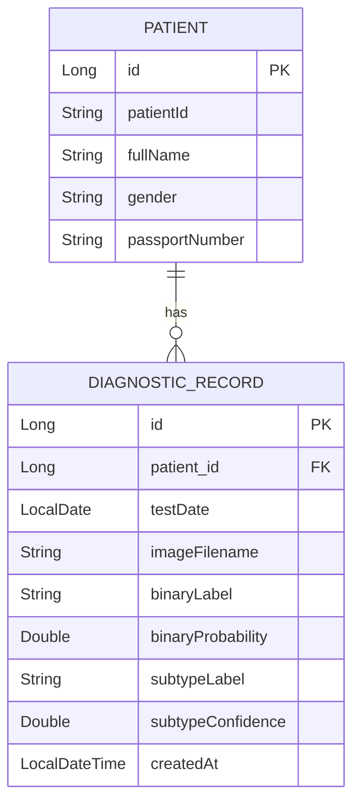

# 🩺 OncoVision AI Breast Cancer Detection & Patient Management System

An end-to-end AI-powered healthcare platform for automated breast cancer diagnosis and patient record management. The system combines deep learning-based histopathological image analysis with a full stack patient management solution, enabling healthcare professionals to efficiently detect breast cancer and maintain diagnostic histories.

---

## 📌 Overview

OncoVision AI integrates advanced computer vision models with enterprise grade backend services to provide:

* 🔬 Automated breast cancer detection from histopathology images
* 🧠 Binary classification (Benign vs Malignant)
* 🧬 Multi-class tumor subtype classification (8 histological subtypes)
* 👥 Patient information and diagnostic record management
* 📊 Persistent storage of prediction results and medical histories
* 🌐 Modern web-based interface for clinicians and researchers

The platform is designed to streamline diagnostic workflows while demonstrating the practical integration of Artificial Intelligence into healthcare systems.

---

## 🏗️ System Architecture

```text
              Histopathology Image
                       │
                       ▼
        ┌──────────────────────────────┐
        │      FastAPI ML Service      │
        │      PyTorch + ResNet18      │
        └──────────────┬───────────────┘
                       │
                       ▼
        ┌──────────────────────────────┐
        │    Spring Boot REST API      │
        │     Business Logic Layer     │
        └──────────────┬───────────────┘
                       │
         ┌─────────────┴─────────────┐
         ▼                           ▼
 ┌──────────────┐          ┌────────────────┐
 │   Frontend   │          │     MySQL      │
 │ Vue 3 + Vite │          │   Database     │
 └──────────────┘          └────────────────┘
```

---

## 🤖 Machine Learning Pipeline

The AI engine utilizes transfer learning with ImageNet pretrained ResNet 18 architectures trained on the BreakHis breast cancer histopathological dataset.

### Binary Classification Model

Determines whether a tissue sample is:

* Benign
* Malignant

The model threshold was optimized to maximize malignant recall, reducing the likelihood of missed cancer cases.

### Multi-Class Classification Model

Identifies one of eight histopathological breast cancer subtypes:

#### Benign Tumors

* Adenosis
* Fibroadenoma
* Phyllodes Tumor
* Tubular Adenoma

#### Malignant Tumors

* Ductal Carcinoma
* Lobular Carcinoma
* Mucinous Carcinoma
* Papillary Carcinoma

> The final clinical diagnosis (Benign/Malignant) is always determined by the binary classifier, while the subtype classifier provides additional pathological detail.

---

## 📈 Model Performance

Evaluation performed on a held out test dataset using BreakHis images at 200× magnification.

| Model              | Task                   | Accuracy  | Additional Metrics         |
| ------------------ | ---------------------- | --------- | -------------------------- |
| Binary Detector    | Benign vs Malignant    | **95.5%** | Malignant Recall: **100%** |
| Subtype Classifier | 8-Class Classification | **90.6%** | Macro F1-Score: **88.2%**  |

### Key Highlights

✅ High sensitivity for malignant cases

✅ Reduced risk of false negative diagnoses

✅ Strong multi-class classification capability

✅ Suitable foundation for clinical decision-support research

> Note: Results are based on image level splitting. Future studies should employ patient-level splitting to eliminate potential data leakage and provide more robust clinical validation.

---

## 🗄️ Database Design



### Core Entities

#### Patient

Stores demographic and identification information.

#### Diagnostic Record

Stores prediction results, confidence scores, uploaded image references, and timestamps for future auditing and clinical review.

---

## 🔌 REST API

### Patient Management

| Method | Endpoint             | Description                  |
| ------ | -------------------- | ---------------------------- |
| POST   | `/api/patients`      | Create a new patient         |
| GET    | `/api/patients`      | Search and paginate patients |
| GET    | `/api/patients/{id}` | Retrieve patient details     |
| PUT    | `/api/patients/{id}` | Update patient information   |
| DELETE | `/api/patients/{id}` | Remove patient record        |

### Diagnostic Operations

| Method | Endpoint                      | Description                                        |
| ------ | ----------------------------- | -------------------------------------------------- |
| POST   | `/api/patients/{id}/diagnose` | Upload image, perform prediction, and save results |
| GET    | `/api/patients/{id}/records`  | Retrieve patient diagnostic history                |

---

## 💻 Technology Stack

### Artificial Intelligence

* Python
* PyTorch
* TorchVision
* FastAPI

### Backend Development

* Java
* Spring Boot
* Spring Data JPA
* Maven

### Database

* MySQL

### Frontend

* HTML5
* CSS3
* JavaScript
* Bootstrap
* REST API Integration

---

## 🚀 Getting Started

### 1. Start the Machine Learning Service

```bash
cd ml/service

pip install -r requirements.txt

uvicorn app:app --host 0.0.0.0 --port 8000
```

### 2. Start the Backend API

```bash
cd backend

./mvnw spring-boot:run
```

### 3. Start the Frontend

```bash
cd frontend

npm install
npm run dev
```

### 4. Access the Application

```text
Frontend:    http://localhost:5173
Backend API: http://localhost:8080
ML Service:  http://localhost:8000
```

---

## 📂 Dataset

### BreakHis Dataset

The Breast Cancer Histopathological Database (BreakHis) contains microscopic biopsy images collected from breast tumor tissue samples.

Dataset Characteristics:

* 7,909 microscopic images
* 82 patients
* 8 tumor subtypes
* Multiple magnification levels
* Publicly available for academic research

Magnification used in this project:

* 200× Histopathological Images

---

## 🔮 Future Enhancements

* Patient-level evaluation protocol
* Explainable AI (Grad-CAM visualizations)
* User authentication and role-based access control
* PDF diagnostic report generation
* Cloud deployment with Docker and Kubernetes
* Electronic Health Record (EHR) integration
* Multi-image ensemble predictions

---

## 📜 License

This project is developed for educational, research, and healthcare AI demonstration purposes.

---

### Developed with ❤️ using Deep Learning, Spring Boot, and Modern Web Technologies.
